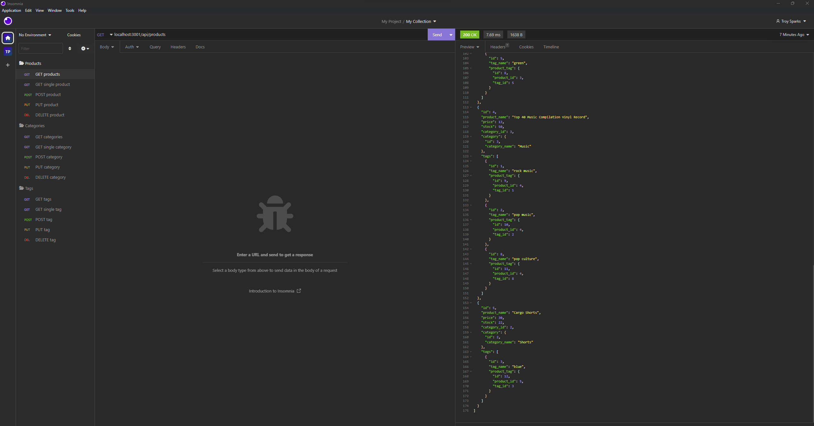

# E-Commerce-BackEnd

This is the backend for an e-commerce website, built with Express and Sequelize. It is responsible for handling all the data related to products, categories, and tags.

[Watch the video!](https://www.youtube.com/watch?v=FExG0wkIIJI)



## Getting Started

These instructions will get you a copy of the project up and running on your local machine for development and testing purposes.

### Prerequisites

What you need to run the app:

- Node.js and npm installed on your local machine
- NPM 
- MySQL or any other SQL database management system (if not using JAWSDB)
- .env file in root folder for DB credentials. (.env.EXAMPLE provided)

### Installing

A step by step series of examples that tell you how to get a development environment running:

```
npm install
npm run seed
npm start
```

## Dependencies

The project uses the following packages:

- Express
- Sequelize
- dotenv

## Endpoints
The following endpoints are available:

## Product Endpoints

HTTP Method | URL | Description
--- | --- | ---
GET | /api/products | Gets all products
GET | /api/products/:id | Gets a single product with the given id
POST | /api/products | Creates a new product
PUT | /api/products/:id | Updates a product with the given id
DELETE | /api/products/:id | Deletes a product with the given id

## Tag Endpoints

HTTP Method | URL | Description
--- | --- | ---
GET | /api/tags | Gets all tags
GET | /api/tags/:id | Gets a single tag with the given id
POST | /api/tags | Creates a new tag
PUT | /api/tags/:id | Updates a tag with the given id
DELETE | /api/tags/:id | Deletes a tag with the given id

## License
<br />

## Questions
<br /> 
Any questions?<br />

###### [GitHub](https://github.com/iskry)<br /> 
###### [Email](iskrydev@gmail.com)<br />

